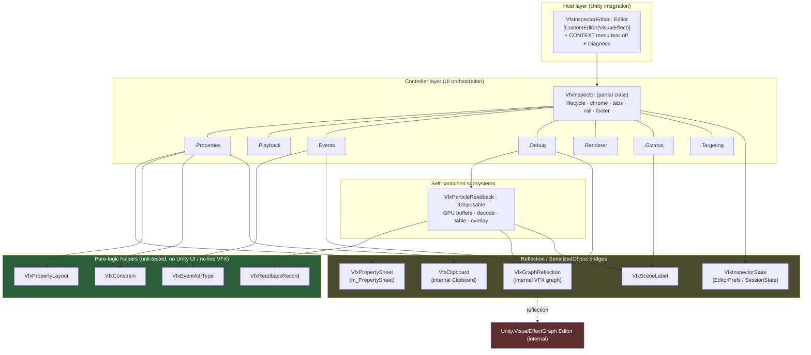
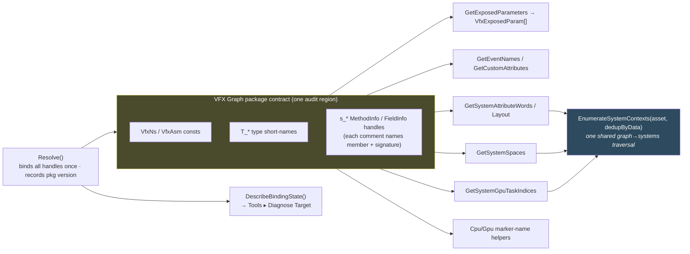
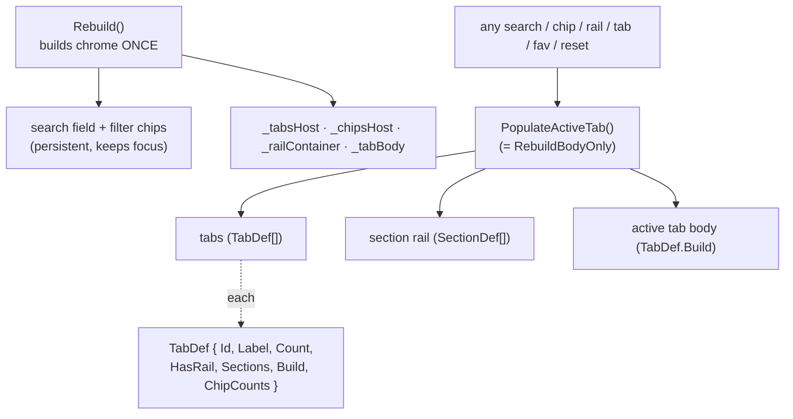
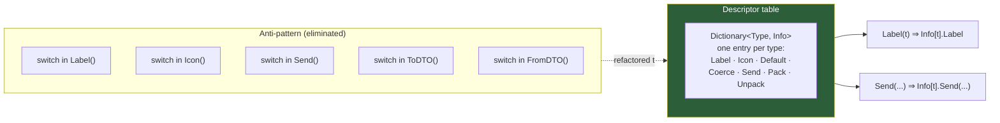
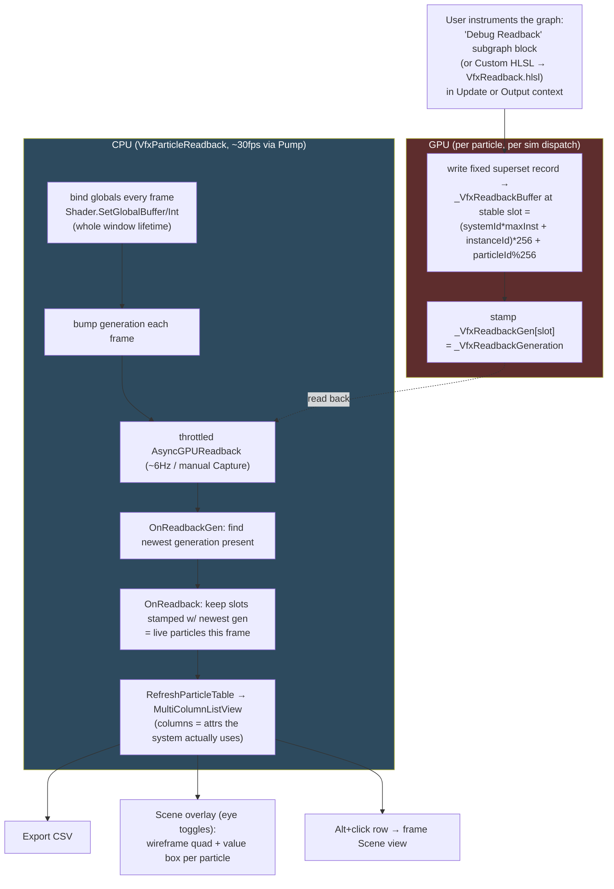
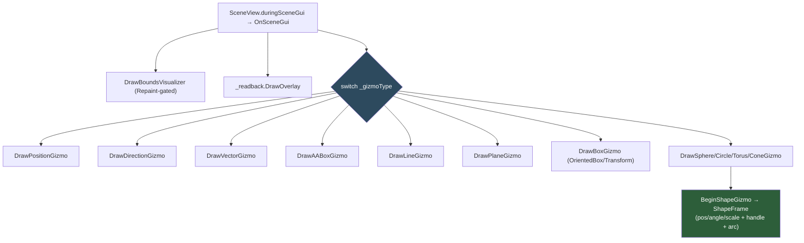
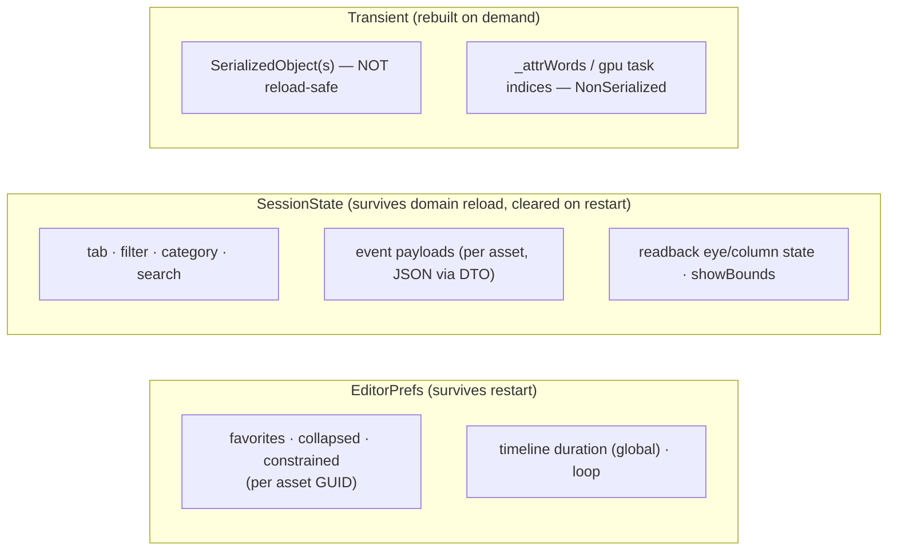
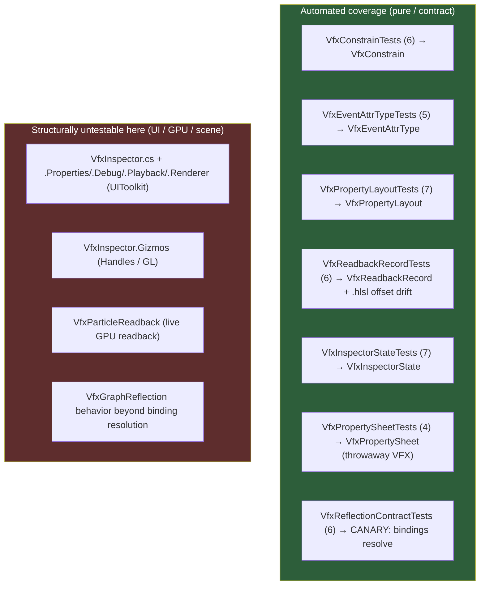

# VFX Inspector — Architecture & Code Overview

> A technical deep-dive into the `com.vfxtools.vfxinspector` package, written from two lenses:
> the **Software Architect** (system design, patterns, scalability, risk) and the
> **Software Developer** (code structure, maintainability, hotspots). For end-user docs see
> [`README.md`](README.md); for the exhaustive ground-truth notes see
> [`Documentation~/VfxInspector.md`](Documentation~/VfxInspector.md).

---

## Table of contents

1. [At a glance](#1-at-a-glance)
2. [What it is and why it exists](#2-what-it-is-and-why-it-exists)
3. [Package & assembly layout](#3-package--assembly-layout)
4. [Layered architecture](#4-layered-architecture)
5. [Runtime data flow](#5-runtime-data-flow)
6. [The reflection bridge — the load-bearing wall](#6-the-reflection-bridge--the-load-bearing-wall)
7. [The `VfxInspector` controller — partial-class anatomy](#7-the-vfxinspector-controller--partial-class-anatomy)
8. [Recurring design pattern: descriptor tables](#8-recurring-design-pattern-descriptor-tables)
9. [The particle-readback subsystem](#9-the-particle-readback-subsystem)
10. [Scene-view gizmos](#10-scene-view-gizmos)
11. [State & persistence](#11-state--persistence)
12. [Testing strategy & coverage map](#12-testing-strategy--coverage-map)
13. [Architect's assessment](#13-architects-assessment)
14. [Developer's assessment](#14-developers-assessment)
15. [Actionable questions & roadmap](#15-actionable-questions--roadmap)

---

## 1. At a glance

| | |
|---|---|
| **Package id** | `com.vfxtools.vfxinspector` |
| **Version** | `0.4.0` |
| **Unity** | `6000.0+` (developed against `6000.6.0a2`) |
| **Hard dependency** | `com.unity.visualeffectgraph` `17.6.0` |
| **Distribution** | UPM (add from disk / git URL) |
| **License** | MIT |
| **Editor source** | ~7,500 LOC across 19 `.cs` files |
| **Tests** | 41 EditMode tests across 7 files (~630 LOC) |
| **Nature** | Editor-only tooling — a `[CustomEditor(typeof(VisualEffect))]` that replaces Unity's stock VFX inspector |

**The core trick:** a `[CustomEditor]` declared in a *non-Unity assembly* takes precedence over the
VFX package's own `AdvancedVisualEffectEditor`. That is the entire reason this package can supplant the
built-in inspector without patching Unity.

---

## 2. What it is and why it exists

Unity's stock `VisualEffect` inspector is functional but sparse. This package replaces it with a denser,
tabbed, more controllable surface:

- **Properties** — categorized, struct-aware exposed parameters with typed controls, favorites, modified
  markers, copy/paste, constrain-proportions lock, and per-category enable gates.
- **Playback** — a persistent transport (scrub/play/step/loop/rate) plus Duration, Seed/Reseed, Initial
  Event, and a `VFXEventAttribute` payload editor.
- **Debug** — live stats (CPU/GPU time, attribute memory), per-system capacity bars, texture usage, a
  bounds visualizer, and an opt-in **per-particle attribute spreadsheet** with CSV export.
- **Renderer** — the sibling `VFXRenderer` settings.
- **Scene gizmos** — custom edit handles for spaceable struct properties (Position/Direction/Box/Cone/
  Sphere/Circle/Torus/Line/Plane/Transform).

Any single tab can be **torn off** into a native dockable `PropertyEditor` popup.

---

## 3. Package & assembly layout

Three assemblies with a strict one-way reference chain. Crucially, the editor assembly references the VFX
**Graph editor** assembly *nowhere* — all editor-internal VFX types are reached by reflection.

```mermaid
graph TD
    subgraph pkg["com.vfxtools.vfxinspector"]
        direction TB
        RT["Runtime/<br/><b>VfxTools.VfxInspector.Runtime</b><br/>ReadbackInstanceId (VFXType)"]
        ED["Editor/<br/><b>VfxTools.VfxInspector.Editor</b><br/>(Editor-only · the whole tool)"]
        TS["Tests/Editor/<br/><b>VfxTools.VfxInspector.Editor.Tests</b><br/>(EditMode · UTF)"]
        RB["Readback/<br/>VfxReadback.hlsl<br/>Debug Readback.vfxblock"]
        DOC["Documentation~/<br/>VfxInspector.md (ground truth)"]
    end

    ED -->|references| RT
    TS -->|references + InternalsVisibleTo| ED
    ED -.->|reflection only<br/>(never a compile ref)| VFXED["Unity.VisualEffectGraph.Editor<br/>(internal types)"]
    ED -->|compile ref| BUILTIN["UnityEngine.VFXModule + CoreModule<br/>(VisualEffect / VisualEffectAsset /<br/>VFXRenderer / VFXEventAttribute)"]
    RT -->|references| VFXRT["Unity.VisualEffectGraph.Runtime"]
    ED -.->|loads at runtime| RB

    style ED fill:#2d4a5e,color:#fff
    style VFXED fill:#5e2d2d,color:#fff
```

**Why the reflection-only edge to the Graph editor assembly matters:** the editor assembly's asmdef has
`"references": ["VfxTools.VfxInspector.Runtime"]` and nothing else from VFX. The compile-time types it
*does* use live in the **built-in** `UnityEngine.VFXModule`. Everything in the graph/gizmo/types layer is
`internal` to `Unity.VisualEffectGraph.Editor` and is bound via reflection strings. This keeps the package
compiling even when those internals shift — it **degrades gracefully** (empty lists / no-ops) rather than
failing to build.

---

## 4. Layered architecture



**The architectural intent is clear and consistent:** push every piece of logic that *can* be made pure
and headless down into the green "pure-logic" layer (so it is unit-testable without a window or a live
effect), confine all the fragile reflection to the yellow bridge layer (so a package update has one audit
surface), and keep the controller layer focused on UIToolkit orchestration.

---

## 5. Runtime data flow

The inspector is **selection-driven and clock-driven**. Two independent loops run while it's alive: a
build/refresh path triggered by selection and edits, and a ~30 fps heartbeat for live values and GPU
readback.

```mermaid
sequenceDiagram
    autonumber
    participant U as User / Unity
    participant E as VfxInspectorEditor
    participant C as VfxInspector (controller)
    participant R as VfxGraphReflection
    participant S as VfxPropertySheet
    participant V as VisualEffect (live)

    U->>E: Select GameObject w/ VisualEffect
    E->>C: new VfxInspector(this) · Enable()
    Note over C: wires Undo, projectChanged,<br/>SceneView.duringSceneGui, EditorApplication.update
    E->>C: SetTargets(targets) · Rebuild()
    C->>R: GetExposedParameters(asset)
    R-->>C: List&lt;VfxExposedParam&gt; (reflection)
    C->>C: build chrome → tabs → rail → body (PopulateActiveTab)

    rect rgb(40,60,80)
    Note over U,V: Edit loop
    U->>C: edit a typed control
    C->>S: SetValueAll / ResetAll (per-instance SerializedObject)
    S->>V: ApplyModifiedProperties (undo + prefab + multi-edit safe)
    end

    rect rgb(40,74,58)
    Note over C,V: ~30fps heartbeat (Tick, focus-independent)
    C->>V: advance playback clock / Simulate / SeekTo
    C->>C: RefreshDebugStats (live counts in place)
    C->>C: _readback.Pump (throttled AsyncGPUReadback)
    end

    U->>E: deselect / domain reload / OnDisable
    E->>C: Disable() (StopProfiling · readback.Dispose · SavePayloads)
```

Key design decisions visible here:

- **Writes never go through a single multi-target `SerializedObject`** — they fan out per-instance keyed by
  `m_Name` (`SetValueAll`/`ResetAll`), which is index-safe across instances that share an asset.
- **The heartbeat is `EditorApplication.update`, not the panel scheduler.** An unfocused popup throttles its
  panel updates, which would starve the readback pump; the global heartbeat fires regardless of focus and
  self-gates to ~30 fps.
- **Stickiness:** when the selection isn't an editable scene VFX, the inspector keeps the last target rather
  than blanking — so clicking around the Scene/VFX Graph editor doesn't reset the panel.

---

## 6. The reflection bridge — the load-bearing wall

`VfxGraphReflection` is the single most architecturally significant file. The entire feature set above the
built-in runtime API (exposed parameters, categories, events, custom attributes, per-system attribute
layout, sim-space, CPU/GPU profiler markers, texture usage) is reached through it.



Resilience features worth calling out:

- **Graceful degradation** — every binding failure yields an empty list / no-op, never an exception that
  reaches the user.
- **Single audit surface** — namespace/assembly names, type short-names, and member handles are all
  declared in one region at the top of the file. The doc's standing instruction is: *on a package update,
  audit that region.*
- **Version-aware diagnostics** — `Resolve()` records the installed package version; a binding failure logs
  it next to the authored-against version, and `DescribeBindingState()` reports every core and optional
  handle so it's obvious exactly what broke.
- **By-name, not by-ordinal mapping** — custom-attribute types and sim-spaces are mapped from the
  enum/Signature member *name*, so a future package that reorders or inserts members can't silently mistype
  data.
- **Real defensive scars** — e.g. the `GetGPUTaskMarkerName(name, int)` native call is **not** bounds-checked
  and an out-of-range task index causes an uncatchable access-violation editor crash; the code now only
  probes task indices the graph reports as valid (`GetSystemGpuTaskIndices`). The accessor renamed
  `GetOrCreateGraph → GetGraph` mid-`17.6.0`-line, so the bridge tries both names.

> **Architect's note:** this file *is* the project's primary risk concentration and its primary risk
> *mitigation* simultaneously. Every Unity/VFX upgrade is a regression event scoped almost entirely here —
> which is exactly the design goal. See [§12](#12-testing-strategy--coverage-map) for the canary test that
> guards it.

---

## 7. The `VfxInspector` controller — partial-class anatomy

`VfxInspector` is one `partial class` split across 8 files purely for navigability — same class, shared
private state, no behavioral boundary. This is the dominant code-mass in the project.

| File | LOC | Concern |
|---|---:|---|
| `VfxInspector.cs` | 948 | Lifecycle, `Rebuild`/`PopulateActiveTab`/chrome, tabs/rail/chips/footer, All tab, shared helpers |
| `VfxInspector.Properties.cs` | 860 | Properties tab: category groups, struct cards, typed `Bind<T>`, constrain, copy/paste, enable gate |
| `VfxInspector.Gizmos.cs` | 850 | Scene-view edit gizmos for spaceable structs |
| `VfxInspector.Events.cs` | 621 | Send-Event chips + `VFXEventAttribute` payload editor |
| `VfxInspector.Debug.cs` | 527 | Debug tab stats grid, profiling markers, per-system bars, textures, bounds |
| `VfxInspector.Playback.cs` | 483 | Persistent transport + Playback-tab `PField` options |
| `VfxInspector.Renderer.cs` | 445 | `VFXRenderer` settings (`RField` rows) |
| `VfxInspector.Targeting.cs` | 157 | Selection→editable VFX, per-instance `SerializedObject`s, multi-edit, rail persistence |

The UI chrome itself is a small, uniform model:



Every tab is a `TabDef`; every rail entry a `SectionDef`. Search filters only the active tab; rail selection
is persisted per-tab. A torn-off "solo" popup pins one tab, hides the strip, and becomes a passive observer
(its `Tick` doesn't drive playback, so multiple popups never fight over the shared effect's clock).

---

## 8. Recurring design pattern: descriptor tables

The codebase's signature pattern — applied consistently — is **collapse per-type / per-field `switch`
duplication into a single descriptor table**, then make every consumer a one-liner that indexes the table.
This is the form most of the recent refactoring work has taken.



Where it appears:

| Table | File | Keyed by | Replaces |
|---|---|---|---|
| `VfxEventAttrType.Info` | `VfxEventAttrType.cs` | `EventAttrType` | 6 parallel switches in `.Events.cs` |
| `s_TypeBridge` | `VfxPropertySheet.cs` | `SerializedPropertyType` | per-type read/write |
| `s_ClipBridge` / `s_ColorBridge` | `.Properties.cs` | sheet/real type | copy/paste eligibility & coercion |
| `TabDef` / `SectionDef` | `VfxInspector.cs` | — | tab & rail wiring |
| `PField` / `RField` / `Setting` | `.Playback`/`.Renderer` | — | per-setting row model |
| `VfxReadbackRecord.Attrs` | `VfxReadbackRecord.cs` | attribute | HLSL record offsets + decoders |

Three of these tables (`EventAttrType`, the shared `EnumerateSystemContexts` traversal, and the gizmo
`BeginShapeGizmo`/`ShapeFrame` prologue) are the product of deliberate refactors that turned verbatim
duplication into single sources of truth — each shipped behavior-preserving and verified by the EditMode
suite.

---

## 9. The particle-readback subsystem

`VfxParticleReadback` is the most technically ambitious feature: VFX particles are GPU-only with **no
managed readback API**, so the spreadsheet is built on a global-UAV GraphicsBuffer pattern. It is a
self-contained `IDisposable` subsystem (not a partial of the controller) — it owns its GPU buffers, decoded
state, and the table; the controller only feeds it the selection and drives its lifecycle.



Design subtleties that the code (and the doc) treat as hard-won invariants:

- **Generation stamp, not a per-frame counter reset.** C#'s `Pump` runs on `EditorApplication.update` while
  the VFX sim runs on *repaint* — decoupled in the editor. A per-frame reset outran the sim and read back
  empty; the "newest generation present" stamp is immune to that ordering.
- **Stable slots, not an append ring.** A ring's slots advance every frame, so rows jumped; `particleId`
  gives each row a stable address that survives sort/refresh and drops when the particle dies.
- **Multi-system + per-instance separation.** `systemId` is wired per-block; instance separation uses a
  typed `ReadbackInstanceId` blackboard property (the reason the `Runtime/` assembly exists), resolved
  **by type** so any name works. Selected instances get ids 0..K-1; all *other* instrumented instances in
  the scene are pushed out of range so they don't leak into the table.
- **Globals bound for the whole window lifetime** (not just when the panel shows), because the instrumented
  graph references them on every dispatch — leaving them unbound triggers shader warnings.

---

## 10. Scene-view gizmos

`OnSceneGui` (wired to `SceneView.duringSceneGui`) is a **uniform dispatcher**: after drawing the bounds
visualizer and readback overlay it `switch`es `_gizmoType` to a per-type `DrawXGizmo(leaves, t, local)`
method. The four shape gizmos (Cone/Sphere/Circle/Torus) share an identical prologue via
`BeginShapeGizmo` → `ShapeFrame` (world TRS matrix + arc state), so each `Draw*Gizmo` only reads its own
radius leaves.



The most important developer-facing gotcha is encoded as a rule: **cosmetic draws
(`DrawLine`/`ConeHandleCap`) must be guarded by `Event.current.type == EventType.Repaint`** — drawing caps
on other events corrupts GL state and bleeds pixel-block artifacts across both the Scene view and the
window. Gizmos have **no automated coverage** (the headless test suite can't drive scene rendering), so
they are verified by compile + manual Scene-view passes.

---

## 11. State & persistence

Three distinct persistence scopes, each chosen deliberately:



`VfxInspectorState` centralizes the prefs/session keys. Two recurring constraints drive the design: a
`SerializedObject` does **not** survive a domain reload (so `Rebuild` recreates it when null, while the
`VisualEffect` reference may persist), and several reflection-derived caches are `[NonSerialized]`/empty
until the graph compiles — hence sim-space comes from the always-serialized `GetSystemSpaces` rather than
the compile-gated attribute layout.

---

## 12. Testing strategy & coverage map

**41 EditMode tests, ~8% test-to-code ratio.** This is *deliberately* concentrated, not comprehensive: the
strategy is to extract every piece of pure logic into a headless helper and test *that* exhaustively, while
the rendering/interaction layers (which the headless EditMode suite structurally cannot drive) rely on
compile + manual verification.



The two highest-value tests:

- **`VfxReflectionContractTests` — the package-update canary.** Asserts the reflection bindings resolve
  (`available == True`) and checks param types, event names, and by-name custom-attribute mapping against
  authored `.vfx` fixtures. This is the early-warning system for a VFX package upgrade breaking the bridge.
- **`VfxReadbackRecordTests`** includes an *offset-contract* test guarding against `VfxReadback.hlsl` and the
  C# decoder drifting apart — the HLSL record layout and the C# `Attrs` table must agree.

Fixture-dependent tests `Assert.Ignore` (not fail) when their `.vfx` is absent, so the suite stays green in
environments without the fixtures. Run via **Window ▸ General ▸ Test Runner ▸ EditMode**.

---

## 13. Architect's assessment

### Strengths

- **Risk is deliberately concentrated and contained.** All fragility from depending on `internal` VFX types
  lives behind `VfxGraphReflection` with a single audit region, graceful degradation, version-aware
  diagnostics, and a contract canary test. This is a textbook way to depend on an unstable surface.
- **Clean dependency direction.** Runtime ← Editor ← Tests, with no compile-time edge to the VFX editor
  assembly. The package self-contains its risk.
- **Testability-by-extraction is a genuine architectural choice, not an accident.** Pure logic is
  systematically pushed into headless, unit-tested helpers; the descriptor-table pattern both reduces
  duplication and creates those test seams.
- **Subsystem isolation where it counts.** The readback feature — by far the most complex and the only one
  touching GPU resources — is an `IDisposable` subsystem with a narrow interface, not entangled in the
  controller.

### Risks & scalability concerns

- **Version coupling is the existential risk.** The tool tracks a *single* VFX Graph line (`17.6.0`,
  `6000.6.0a2`) and has already absorbed a mid-line rename (`GetOrCreateGraph`/`GetGraph`). Supporting a
  broader Unity range will multiply the conditional-binding logic in the bridge. There is no CI matrix
  across Unity/VFX versions — the canary test only runs against whatever is installed.
- **The controller is a large shared-state surface.** One `partial class` of ~4,900 LOC across 8 files
  shares all private fields. The file split aids navigation but provides no encapsulation boundary;
  cross-concern coupling can grow silently. This is the main scalability limit on the *codebase* (as opposed
  to the runtime).
- **No GPU/UI integration test harness.** The most failure-prone areas (gizmo GL state, readback
  correctness, multi-system/multi-instance separation) are verified manually. Regressions here are invisible
  to CI.
- **Hard single dependency, undeclared platform breadth.** `package.json` pins exactly one VFX version;
  behavior on HDRP vs URP vs BiRP is handled in code (e.g. rendering-layer/sorting-layer via public SRP
  APIs) but not asserted anywhere automated.

---

## 14. Developer's assessment

### Maintainability — what's good

- **Self-documenting at an unusual level.** `Documentation~/VfxInspector.md` is a 700+ line ground-truth
  record, and most files open with a substantial header comment explaining *why*. The "verified against
  package source — do NOT re-guess" sections capture institutional knowledge that would otherwise evaporate.
- **Consistent idioms.** The descriptor-table pattern, the `Bind<T>` generic control factory, the uniform
  `TabDef`/`SectionDef`/`PField`/`RField` row models, and the gizmo dispatcher all repeat predictably — once
  you learn one, you can read the rest.
- **Defensive scars are documented inline.** Non-obvious constraints (Repaint-gating GL draws, the GPU
  task-index crash, the decoupled Pump/sim ordering, the `color`-as-Vector3 quirk) are written down at the
  call site, so they won't be "fixed" back into bugs.

### Hotspots — where to be careful

| Hotspot | LOC | Concern |
|---|---:|---|
| `VfxInspector.cs` | 948 | God-file for chrome/lifecycle; the doc flags `Resolve()`-style methods as long |
| `VfxParticleReadback.cs` | 860 | `Build()` is a ~139-line UI builder; GPU lifecycle correctness is subtle |
| `VfxGraphReflection.cs` | 888 | `Resolve()` ~148-line init; the audit burden on every upgrade |
| `.Properties.cs` / `.Gizmos.cs` | 850–860 | dense; gizmos have no test net |

- **Documentation paths have drifted.** `Documentation~/VfxInspector.md` still refers to
  `Assets/VfxInspector/Editor/...` in places, but the package is now UPM-laid-out (`Editor/`, `Runtime/`,
  `Tests/Editor/`, `Readback/`). Harmless but worth a sweep so new contributors aren't misled.
- **`color`-attribute Vector3 vs Vector4** is exactly the kind of trap that's easy to "simplify" into a
  silent regression — the code sends `color` via `SetVector3` on purpose (the stock Event Tester's
  `SetVector4` silently fails to pass it).

---

## 15. Actionable questions & roadmap

Open questions to guide further development (each maps to a risk or gap above):

1. **Version breadth — what's the supported matrix?** Should the package commit to a single VFX line (and
   bump in lockstep), or grow a tested compatibility range? If the latter, the bridge's dual-name lookups
   need a deliberate strategy and the canary test needs a CI matrix across Unity/VFX versions.
2. **Can the reflection contract be CI-gated?** `VfxReflectionContractTests` is the early-warning system but
   only runs locally against whatever is installed. A headless EditMode CI run on each target VFX version
   would turn upgrade breakage from "discovered by a user" into "caught by a pipeline."
3. **Is there a smoke-test path for the GPU readback?** Even a single scripted test that instruments a
   fixture graph, runs a few sim frames, and asserts non-empty decoded rows would cover the project's most
   complex, currently-manual subsystem.
4. **Should the controller's shared state be encapsulated further?** As tabs accumulate features, the single
   ~4,900-LOC `partial class` with fully shared private fields will get harder to reason about. Candidate
   extractions: a `Transport` object, a `ChromeState` object, per-tab view-models.
5. **Authoring friction for readback.** The doc itself flags the next step: auto-insert the Debug Readback
   block (or a richer subgraph) and capture *custom* (user) attributes, not just the fixed standard set.
6. **Documentation hygiene.** Reconcile the `Assets/...` paths in `Documentation~/VfxInspector.md` with the
   UPM layout, and consider promoting the "package contract audit checklist" into a short, standalone
   upgrade runbook.

### Already-shipped structural wins (for context)

- Per-type dispatch collapsed into `VfxEventAttrType` / `VfxPropertySheet.s_TypeBridge` descriptor tables.
- The four per-system reflection queries share one `EnumerateSystemContexts` traversal.
- The four shape gizmos share `BeginShapeGizmo`/`ShapeFrame`, and `OnSceneGui` is a uniform dispatcher.

### Explicitly-deferred features (from the doc's "Not done yet")

A scrubbable timeline widget with tick marks/playhead; more Debug visualizers (spawn icons / wireframe /
motion vectors — all internal to VFX); a fav/modified model for the Debug tab; preset save; a
compact/comfortable density toggle; per-row updates without a full body rebuild; subgraph-recursive event
enumeration.

---

*This document was compiled from a full read of the source, asmdefs, `package.json`, `CHANGELOG.md`, and
the ground-truth notes in `Documentation~/VfxInspector.md`. For any VFX-internals detail, that file remains
the authority.*
